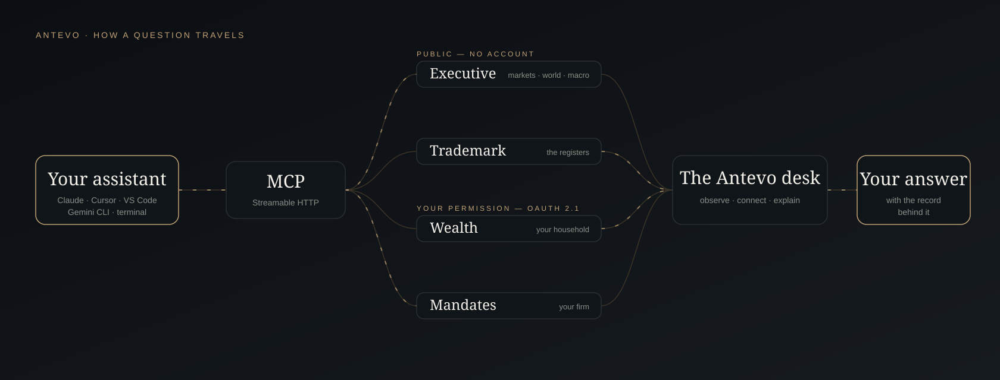

# Antevo: plugins and MCP connections for Claude and any MCP client

**Antevo brings the world around your wealth into the assistant you already use.** Five connections — the Executive Brief, trademark registers, crypto reference prices, your own household and your firm's client book — and 28 skills that know how to read them: dated, attributed, and honest about what they cannot see. Install once in Claude, or point any MCP client at an address.

[](https://github.com/ANTEVO-CH/plugins/actions/workflows/validate.yml)
[](https://registry.modelcontextprotocol.io/v0/servers?search=ch.antevo)
[](#skills)
[](https://www.npmjs.com/package/@antevo/cli)
[](https://antevo.ch)

### Why Antevo

- **A named desk, not a web search.** Answers come from Antevo's published Executive Brief and its dated archive, from the trademark registers themselves, and — when you sign in — from your own record. The assistant says where a read came from and when.
- **Public where it can be, permissioned where it matters.** Executive, trademark screening and crypto need no account and reach no personal data. Wealth and Mandates sign in over OAuth 2.1; your account's own permissions apply.
- **Intelligence, not advice.** The skills hold the line: no invented probabilities, no "clear to use", no buy or sell dressed up as a signal.

## Who this is for

- **Families and private investors.** One question — *"where could I get hurt this week?"* — traced across concentration, risk, leverage and liquidity in your own household, with the market backdrop that explains it.
- **External asset managers and family offices.** Walk into a client meeting with the dossier, goals, correspondence and the review that is due, prepared from the firm's own record.
- **Founders, brand owners and counsel.** Screen a name before you launch, read who holds anything close and how they file, and know how long you have to oppose.
- **Anyone who follows markets and the world.** The daily editorial read, the risk radar, a century of macro history and one reference price per major crypto pair — no account.



## Table of Contents

- [Installation](#installation)
- [Quick Start](#quick-start)
- [The connections](#the-connections)
- [Skills](#skills)
- [Features](#features)
- [Compared to asking a chatbot to search](#compared-to-asking-a-chatbot-to-search)
- [Use cases](#use-cases)
- [Sample Output](#sample-output)
- [Methodology](#methodology)
- [What's New](#whats-new)
- [Limitations](#limitations)
- [Requirements](#requirements)
- [Uninstall](#uninstall)
- [Security and privacy](#security-and-privacy)
- [Ecosystem](#ecosystem)
- [FAQ](#faq)
- [License](#license)

## Installation

### Claude — Claude Code, Claude Desktop and claude.ai

Add the marketplace once, then install what you need:

```text
/plugin marketplace add ANTEVO-CH/plugins

/plugin install antevo-executive@antevo    # public — nothing to sign in to
/plugin install antevo-trademark@antevo    # screening public; your watchlist needs a sign-in
/plugin install antevo-crypto@antevo       # public
/plugin install antevo-wealth@antevo       # your household — OAuth on first use
/plugin install antevo-mandates@antevo     # your firm — by arrangement, OAuth on first use
```

Each plugin wires its connection *and* its skills in one step.

### Any MCP client

Every connection is a remote MCP server over Streamable HTTP. Paste an address into Cursor, VS Code, Windsurf, Zed, Goose or any client that speaks MCP — there is nothing to download and nothing to run. One-click links for Cursor and VS Code, and the Gemini CLI extension, live in [ANTEVO-CH/antevo-mcp](https://github.com/ANTEVO-CH/antevo-mcp/blob/main/INSTALL.md).

```bash
gemini extensions install https://github.com/ANTEVO-CH/antevo-mcp
```

### A terminal

```bash
npx @antevo/cli brief                                                      # no account, nothing installed
npx @antevo/cli call get_crypto_price --server crypto --arg symbol=BTC/USD  # a reference price
npx @antevo/cli login                                                      # device code — works over SSH
```

Source: [ANTEVO-CH/cli](https://github.com/ANTEVO-CH/cli).

## Quick Start

No account needed for any of these once `antevo-executive`, `antevo-trademark` and `antevo-crypto` are installed:

```text
What happened in markets today, and what does the desk make of it?
What could go wrong from here — and what would settle it?
Has anyone filed anything close to "Novara"?
How long do I have to oppose an EU trademark, and from when?
Is bitcoin above its 200-day average?
How has ETH done against the euro this quarter?
```

With `antevo-wealth` or `antevo-mandates` and your sign-in:

```text
What's my brief today?
Where could I get hurt this week?
Which clients are due a review this month?
Prepare me for my meeting with the Birch family.
```

Invoke a skill directly with `/<plugin>:<skill>` — for example `/antevo-executive:risk-radar` — or just ask; the skills trigger on the questions they answer.

## The connections

| | Connection | Address | Access | Tools |
|:--|:--|:--|:--|--:|
| **I.** | **Executive** — the daily editorial read, risk radar, forward calendar, dated archive, per-sector desk reads, a world-events map and macro-economic history | `https://api.antevo.ch/mcp/executive/mcp` | Public | 15 |
| **II.** | **Trademark** — screen a name, read a holder's filing pattern, check an opposition window | `https://trademark.antevo.ch/mcp` | Public screening | 4 |
| **III.** | **Crypto** — one reference price per major pair, daily history and technical signals | `https://api.antevo.ch/mcp/crypto/mcp` | Public | 4 |
| **IV.** | **Wealth** — your household: holdings, allocation, risk, real assets, liabilities, goals and documents | `https://api.antevo.ch/mcp/wealth/mcp` | Your account | 36 |
| **V.** | **Mandates** — your firm's client book: clients, reviews, meeting briefs, goals, documents, succession, client email | `https://api.antevo.ch/mcp/mandates/mcp` | By arrangement | 24 |

All five are listed in the official [MCP Registry](https://registry.modelcontextprotocol.io/v0/servers?search=ch.antevo) under `ch.antevo`. Tool counts are read live from each server's `tools/list`.

## Skills



| Skill | What it does |
|:--|:--|
| **antevo-executive** | *public* |
| `/antevo-executive:world-brief` | What's happening in markets and the world — the editorial read, grounded in the numbers |
| `/antevo-executive:risk-radar` | What could go wrong from here — each risk graded as published, paired with the reading that would settle it |
| `/antevo-executive:emerging-risks` | How the risk board has moved over weeks — new, escalating, entrenched, gone |
| `/antevo-executive:signal-read` | Antevo's own probability layer — live bands only, dated |
| `/antevo-executive:decode` | What a move actually means, in the desk's own plain language |
| `/antevo-executive:story-timeline` | How a story developed, from the dated archive — including where the view shifted |
| `/antevo-executive:desk-read` | Antevo's written view on one area, from shipping and aviation to succession and art |
| `/antevo-executive:world-map` | Chokepoints, submarine cables, conflicts, disasters, displacement, sanctions, cyber, regulatory |
| `/antevo-executive:macro-history` | The long run — prices, rates, house prices and production for about 180 countries |
| **antevo-trademark** | *screening public* |
| `/antevo-trademark:clearance-check` | What is on the registers near a name, and who holds it — never a clearance |
| `/antevo-trademark:opposition-deadline` | How long there is to oppose in a given office, what starts the clock, and the provision |
| `/antevo-trademark:conflict-review` | New filings near your watched names, ranked by consequence — with your sign-in |
| **antevo-crypto** | *public* |
| `/antevo-crypto:price-check` | The reference price for one pair or many, always dated |
| `/antevo-crypto:crypto-performance` | Return, range and worst drawdown over a window, from the daily bars |
| `/antevo-crypto:technical-read` | Moving averages, MACD, RSI, Bollinger and ATR — how each leans, never a trading call |
| **antevo-wealth** | *your account* |
| `/antevo-wealth:daily-brief` | The household's morning note — what matters today and what needs you |
| `/antevo-wealth:wealth-portfolio-review` | A dated review: net worth, allocation, risk and drift, leverage, real assets |
| `/antevo-wealth:portfolio-stress-radar` | Where you could get hurt — a shock traced through concentration, risk, leverage and liquidity |
| `/antevo-wealth:concentration-and-drift` | Concentration by name, class, currency and region, and drift against target |
| `/antevo-wealth:liquidity-and-leverage` | What can be raised in days, weeks or months, and the headroom to covenant triggers |
| `/antevo-wealth:market-signals-period` | What trended over a window, what's new, how correlations shifted |
| `/antevo-wealth:security-analysis` | One instrument through both lenses — fundamentals and technicals |
| `/antevo-wealth:geopolitical-risk` | The world's risks tied to your exposure |
| `/antevo-wealth:watchlist-review` | Your tracked instruments, what moved and why |
| `/antevo-wealth:goals-review` | Funding progress against targets, and the gap to plan |
| **antevo-mandates** | *by arrangement* |
| `/antevo-mandates:reviews-due` | Overdue first, then the next thirty days by risk tier — and a review recorded only on your go |
| `/antevo-mandates:meeting-prep` | One page to walk in with, from the dossier, goals, team and correspondence |
| `/antevo-mandates:succession-scan` | Where succession planning is thin — clients with no checklist reported as "not started" |

## Features

### What does the Executive connection cover?

The Antevo Executive Brief is a daily editorial read on markets and world events. The connection serves today's brief and the dated archive behind it, the risk radar with each risk's trend, impact and probability *as the desk graded them*, the forward calendar, a market snapshot and indices, fourteen per-sector desk reads, a world-events map in nine layers, and about 80,000 macro-economic reference series for roughly 180 countries. No account, no personal data.

### How does trademark screening work?

`screen_mark` compares a name against the registers Antevo reads and returns each hit with a similarity tier, its status, applicant and filing date — and the list of registers it searched, which varies by name. A tier is a string-and-phonetic comparison, not a legal view of confusability. The skills say what exists and which registers were searched; they never call a name clear, and never call anyone a squatter.

### How is the crypto reference price calculated?

One price per pair, never one per exchange. For each whole UTC day, Antevo takes each major exchange's daily bar, drops any quote more than 5% from that day's median close, and publishes only when at least three quotes survive. The published open, high, low and close are volume-weighted across the quotes that remain; volume is their sum. A day is published once the collector's final run for it has landed. Which exchanges contribute is not part of any answer. See [Methodology](#methodology).

### What can the Wealth connection see?

Only the household your Antevo Wealth sign-in can see — positions and accounts, allocation and drift, risk and stress, real assets, liabilities, goals, family structure and documents — through one connection at `/mcp/wealth/mcp`. Every tool is read-only.

### What can the Mandates connection change?

Mandates reaches the signed-in member's own firm. It reads clients, dossiers, reviews, goals, team, documents and client email, and it can also change records in that book: record a review, update a client, set a goal, manage a document. Irreversible actions return a plan first and run only when called again with confirmation, and the skills ask before any change. Access is by arrangement with Antevo.

## Compared to asking a chatbot to search

| | A chatbot searching the web | **Antevo in your assistant** |
|:--|:--|:--|
| **Where the answer comes from** | Whatever pages it finds | **Antevo's published desk, the registers themselves, and — with your sign-in — your own record** |
| **Dated** | Rarely | **Every read carries its date; the archive is addressable by date** |
| **Your holdings or client book** | Not visible | **Visible with your sign-in, scoped to you** |
| **Trademark registers** | Not searched directly | **Screened, with the registers named** |
| **Crypto prices** | A number from somewhere | **One composite reference price, method published** |
| **Advice** | Can drift into it | **Intelligence, not advice — the skills hold the line** |

## Use cases

**A family principal before the week starts.** Asks *"where could I get hurt this week?"*. The stress radar reads concentration, risk, leverage and liquidity in the household's own book, pairs each with the market read that explains it, and ends with what could be done before it matters — without placing a trade or moving a franc.

**An external asset manager before a client meeting.** Asks *"prepare me for the Birch family"*. The meeting-prep skill pulls the dossier, goals against target, the review that is due and the correspondence still waiting for a reply, and offers the full generated brief only after saying it uses credits.

**A founder choosing between three names.** Asks *"is any of Novara, Lumen or Meridian taken?"*. The clearance check screens each, names the registers searched, reads who holds the closest marks and how they file — and leaves the judgement on use to counsel.

## Sample Output

Verbatim excerpts from the live public connections on 14 September 2026, trimmed where marked.

<details>
<summary><code>get_risk_radar</code> — Executive, public</summary>

```json
{
  "status": "ok",
  "as_of": "2026-09-14",
  "scope": "retail",
  "regime": {
    "label": "Capital, not demand, is the constraint on the AI build",
    "narrative": "The AI complex has moved from a regime in which demand was the open question to one in which financing is. …"
  },
  "risks": [
    {
      "title": "Saudi exports run down before the bypass pipeline reopens",
      "trend": "Rising",
      "impact": "severe",
      "probability": "high",
      "why_it_matters": "…"
    }
  ]
}
```

</details>

<details>
<summary><code>get_crypto_price</code> — Crypto, public</summary>

```json
{
  "symbol": "BTC/USD",
  "base": "BTC",
  "quote": "USD",
  "date": "2026-09-13",
  "open": 77259.66367,
  "high": 77426.44845,
  "low": 76465.21002,
  "close": 76806.8034,
  "volume": 5087.020344,
  "change_1d_pct": -0.58,
  "method": "Antevo reference price: a volume-weighted daily bar across major exchanges, with outlying quotes excluded. Whole UTC days only; not a live or tradable quote.",
  "source": { "name": "Antevo", "url": "https://antevo.ch/mcp" }
}
```

</details>

<details>
<summary><code>screen_mark("Meridian")</code> — Trademark, public</summary>

```json
{
  "mark": "Meridian",
  "count": 31,
  "registers": ["EM"],
  "conflicts": [
    {
      "mark_text": "MERIDIAN",
      "app_no": "011139086",
      "source": "EUIPO",
      "status": "REGISTERED",
      "applicant": "Teledyne Detcon",
      "filing_date": "2012-08-24",
      "tier": "identical"
    }
  ]
}
```

</details>

## Methodology

**The chain: observe, connect, explain.** Antevo observes developments in markets and the world, connects them to the things you own, manage and protect, and explains each connection with the record behind it. The connections carry that chain into your assistant; the skills decide how to read it.

**How the skills read.** Every skill in this repository is a written instruction, not code: which tools to call, how to read the result, and what not to say. They lead with consequence rather than list order, date every figure, keep grades as the desk published them, name what was searched, and stop — rather than guess — when a tool refuses or data is missing.

**The crypto reference price, precisely.** Per pair, per whole UTC day, over the exchange whitelist: take each exchange's daily bar; exclude quotes whose close is more than 5% from the day's median close; require at least three surviving quotes; volume-weight open, high, low and close across the survivors. A day is not published until two hours after it ends, so the collector's final fetch of the finished day has landed. Technical signals are computed on those bars with the same indicator code the Antevo technical analyst uses, and are refused for stablecoin pegs and for pairs with fewer than 200 days of history.

## What's New

- **14 September 2026 — Crypto and Mandates.** `antevo-crypto` 0.1.0 (price-check, crypto-performance, technical-read) and `antevo-mandates` 0.1.0 (reviews-due, meeting-prep, succession-scan), both listed in the MCP Registry the same day.
- **`antevo-wealth` 0.5.2.** Technical analysis and the watchlist say how indicators lean, never buy or sell.
- **`antevo-crypto` 0.1.1.** Technical signals say how indicators lean — up, down or neutral, with counts — never buy or sell.
- **`antevo-mandates` 0.1.1.** The skills no longer ask for a firm ID: the connection uses your own firm, and names each one if you belong to several.
- **`antevo-executive` 0.4.0.** Desk reads for fourteen coverage areas, the world-events map and a century of macro-economic history.
- **`@antevo/cli` 0.2.0.** The terminal client reaches all five connections.

Full history: [CHANGELOG.md](CHANGELOG.md).

## Limitations

- **Daily, not live.** The Executive Brief publishes daily; crypto reference prices cover whole UTC days; macro series are quarterly published levels that lag. Nothing here is a live or tradable quote.
- **A screen is not a clearance.** Register coverage varies by name and office, and prior rights that never reach a register are invisible to any search.
- **Your record, as connected.** Wealth and Mandates answer from what your account holds; they cannot see what was never connected.
- **Skills are a Claude feature.** Other MCP clients get the same connections and tools, without the skills that decide how to read them.

## Requirements

- Claude Code, Claude Desktop or claude.ai with plugin support — or any client that speaks MCP over Streamable HTTP
- An [Antevo Wealth](https://antevo.ch/wealth) account for `antevo-wealth`
- An Antevo Mandates firm account for `antevo-mandates` — [by arrangement](https://antevo.ch/mandate)
- Node 20+ for `npx @antevo/cli`

## Uninstall

```text
/plugin uninstall antevo-executive@antevo
/plugin marketplace remove antevo
```

To revoke a connection's access to your account, sign out of the connector in your assistant and revoke it from your Antevo account settings.

## Security and privacy

- **OAuth 2.1 with PKCE** for Wealth and Mandates. Your assistant receives a scoped, short-lived token — never your password.
- **Your chosen AI service receives the information a connection returns**, under that service's own terms.
- **Nothing here trades or moves money.**
- **Hosted in Switzerland.**

Report a vulnerability privately to **contact@antevo.ch** — see [SECURITY.md](SECURITY.md). Privacy: [antevo.ch/policies/privacy-policy](https://antevo.ch/policies/privacy-policy/) · Terms: [antevo.ch/policies/terms-of-use](https://antevo.ch/policies/terms-of-use/).

## Ecosystem

| Repository | What it is |
|:--|:--|
| [**ANTEVO-CH/plugins**](https://github.com/ANTEVO-CH/plugins) | This marketplace — each connection with its skills, one install |
| [**ANTEVO-CH/antevo-mcp**](https://github.com/ANTEVO-CH/antevo-mcp) | Connection metadata: registry manifests, Cursor plugins, the Gemini CLI extension and install links. MIT |
| [**ANTEVO-CH/cli**](https://github.com/ANTEVO-CH/cli) | `@antevo/cli` — the same connections from a terminal |

## FAQ

### What is Antevo?

Antevo connects developments in the world to the things you own, manage and protect — portfolios and property, companies and collections, the names you have built and the clients in your care — with the record behind each connection. These plugins bring that into Claude and any MCP client.

### Do I need an account?

Not for Executive, trademark screening or crypto. Wealth needs an Antevo Wealth account; Mandates needs a firm account, by arrangement.

### Does Antevo give investment advice?

No. It is editorial market intelligence and a reading of your own record. The skills do not recommend trades, convert graded words into percentages, or present indicator tallies as calls.

### Which assistants does this work with?

Claude (Code, Desktop and claude.ai) with the full plugins and skills; Cursor, VS Code, Gemini CLI, Windsurf, Zed, Goose and any Streamable-HTTP MCP client with the connections and tools; and a terminal through `@antevo/cli`.

### Where does the crypto price come from?

It is a composite of major exchanges' daily bars, computed by Antevo as described in [Methodology](#methodology). Antevo publishes the reference price, not its sources.

## License

Copyright © 2026 Antevo. All rights reserved — see [LICENSE](LICENSE). You may install and use these plugins with the Antevo services under the [Terms of Use](https://antevo.ch/policies/terms-of-use/). The connection metadata in [ANTEVO-CH/antevo-mcp](https://github.com/ANTEVO-CH/antevo-mcp) is MIT licensed.

---

<p align="center">
  <b>Antevo</b> · Switzerland · <a href="https://antevo.ch">antevo.ch</a> · <a href="https://antevo.ch/mcp">Connect</a> · <a href="mailto:contact@antevo.ch">contact@antevo.ch</a><br>
  <sub>Intelligence, not advice.</sub>
</p>
